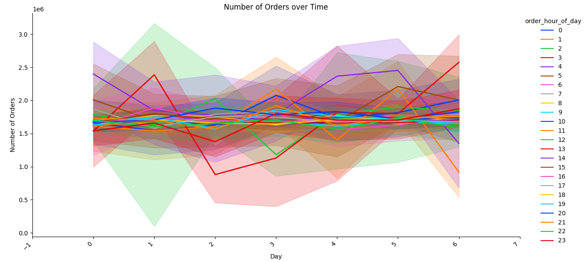
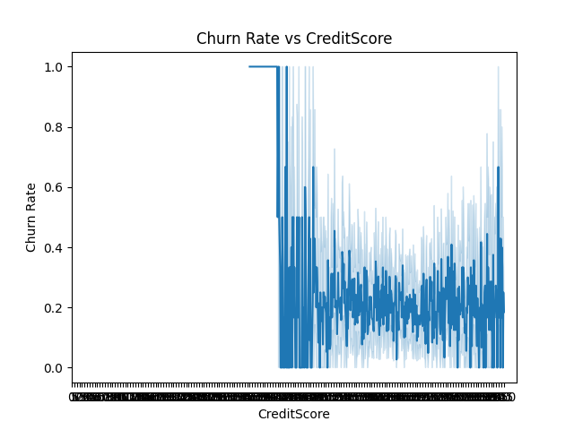
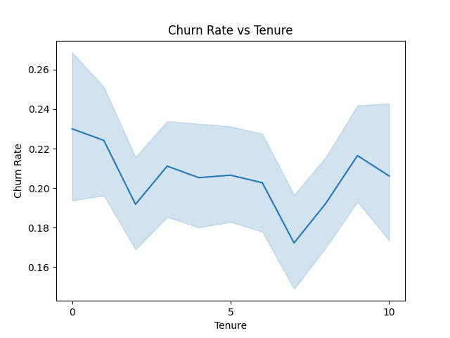
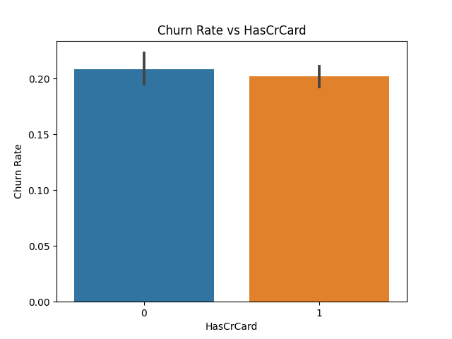
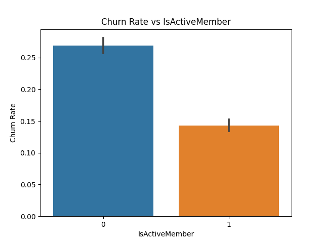

# Instructions

Run the following:

## Setup API key
Create a file named `.env` in the root of this repository 

On the first line, put: 

```OPENAI_API_KEY=YOURKEYHERE```

save the file.

## Setup virtual environment, install requirements via setup_env.sh script:

```
source setup_env.sh
```

The repo uses a sampled version of the dataset. To Download the full kaggle dataset, go to:
https://www.kaggle.com/datasets/yasserh/instacart-online-grocery-basket-analysis-dataset
and unzip the files into the './data/grocery/' directory.

### Run locally:
```
python src/processor/process.py
```

## For remote hosting: 

### Run the server
```
python src/server.py
```


## Demo:
Running on the [Instacart Kaggle dataset](https://www.kaggle.com/c/instacart-market-basket-analysis/data), the data copilot can generate great visualizations that help understand the problem.

To the question of "How might we build a recommendation system for Instacart?", the data copilot can generate the following visualizations:




On the [IT customer churn dataset](https://www.kaggle.com/datasets/blastchar/telco-customer-churn), the data copilot can generate the following visualizations to the question of "Help me complete an LTV analysis to see what can make customers stay":










## Actual prompt to GPT:
The actual prompt to gpt looks like the following (for the instacart basket challenge):

Please write a Python script that utilizes the pandas library to perform feature engineering on data from 3 CSV files. The purpose of the script is to prepare the data for model training to answer the question:
"How can we predict what the next item a user will order will be?"

```
`./data/grocery/order_products__prior.csv` [Rows: 70024]
The columns and first row looks like this:
order_id,product_id,add_to_cart_order,reordered
2,33120,1,1

```
```
`./data/grocery/orders.csv` [Rows: 35105]
The columns and first row looks like this:
order_id,user_id,eval_set,order_number,order_dow,order_hour_of_day,days_since_prior_order
2539329,1,prior,1,2,08,

```
```
`./data/grocery/products.csv` [Rows: 49689]
The columns and first row looks like this:
product_id,product_name,aisle_id,department_id
1,Chocolate Sandwich Cookies,61,19

```


The script should have the following structure:

1. Import all necessary libraries (including Pandas, Numpy, and Scikit-learn or any other libraries needed for feature engineering).
2. Load the datasets into dataframes.
3. Perform exploratory data analysis to understand the data.
4. Clean and pre-process the data, this includes handling missing values, duplicates and any errors in the datasets.
5. Identify and create relevant features that would assist in answering the question. This could involve:
- Feature extraction: Create new features from the existing ones, like binning a continuous variable or creating interaction terms.
- Feature scaling: Standardize or normalize numerical features.
- Encoding categorical variables: Convert categorical variables into a form suitable for machine learning algorithms.
- Feature selection: Remove irrelevant features if necessary, using methods such as univariate feature selection, recursive feature elimination, or others.
6. Transform the data as needed, ensuring that only the relevant dataframes and features are used to answer the question.
7. Save the transformed datasets to files named 'transformed_data_i.csv' (where i is the dataset number) in the directory './output/exp163/'.
8. Make sure the code is efficient, readable, and error-free.
9. Only return text that is python code.

Please, provide the Python code to accomplish the above tasks.
