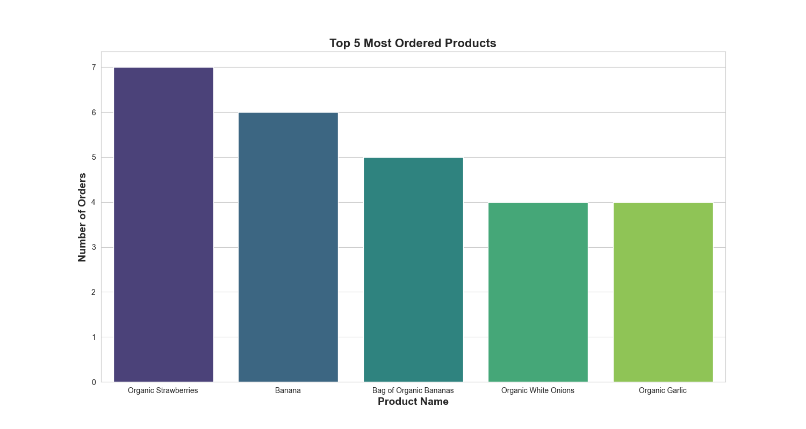

# Instructions

Run the following:

## Setup API key
Create a file named `.env` in the root of this repository 

On the first line, put: 

```OPENAI_API_KEY=YOURKEYHERE```

save the file.

## Setup virtual environment, install requirements via setup_env.sh script:

```
source setup_env.sh
```

The repo uses a sampled version of the dataset. To Download the full kaggle dataset, go to:
https://www.kaggle.com/datasets/yasserh/instacart-online-grocery-basket-analysis-dataset
and unzip the files into the './data/grocery/' directory.

## Run the server
```
python src/server.py
```

## Run locally:
```
python src/processor/process.py
```

## Demo:
Running on the [Instacart Kaggle dataset](https://www.kaggle.com/c/instacart-market-basket-analysis/data), the data copilot can generate great visualizations that help understand the problem.

To the question of "How might we build a recommendation system for Instacart?", the data copilot can generate the following visualizations:



On the [IT customer churn dataset](https://www.kaggle.com/datasets/blastchar/telco-customer-churn), the data copilot can generate the following visualizations:


